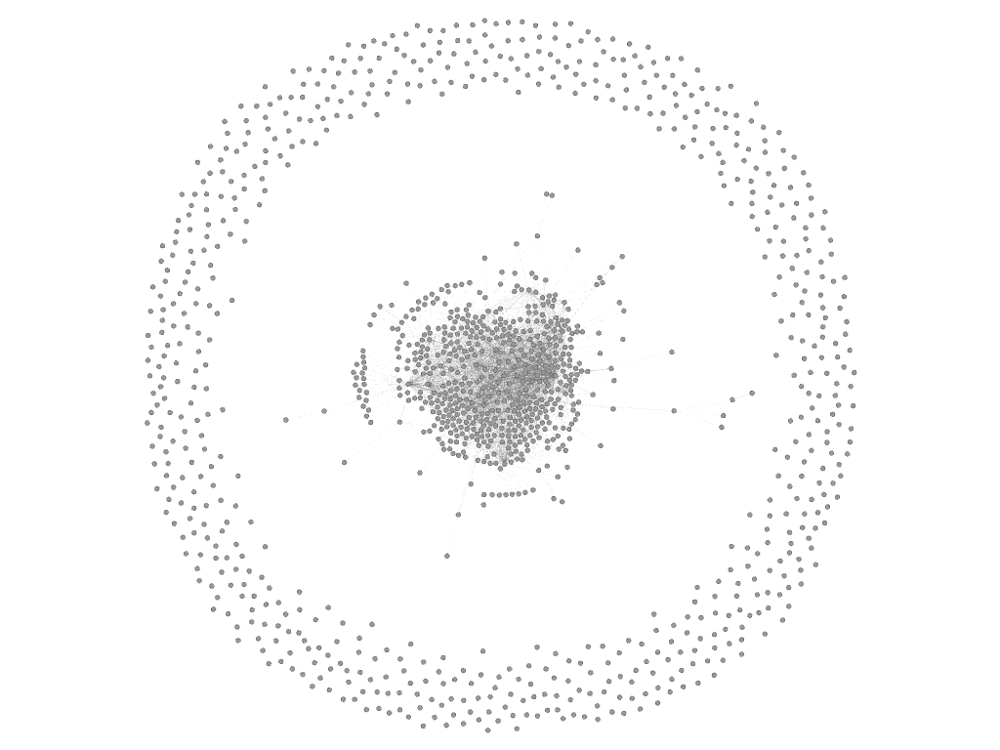
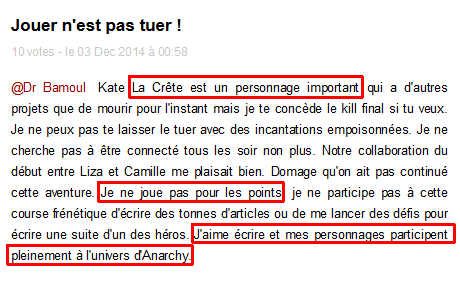

## Application d'une méthode mixte pour l'étude du corpus littéraire collaboratif d'_Anarchy_
<!-- #### Proposition pour appréhender par l'usage   l'écrit en environnement numérique. -->

&nbsp;

&nbsp;

  <small>Nicolas Sauret, UPO - 
3ème journée doctorale du Labex _Les passés dans le présent_ 22 novembre 2016</small>

%%%%%%%%%%%%%%%%%%%%%%%%%%%%%%%%%%%%%%%%%%%%%

§§§§§§§§§§§§§§§§§§§§§§§§§§§§§§§§§§§§§§§§§§§§§

### Le corpus

* issu de l'expérience transmédia Anarchy
* 398 auteurs actifs
* 1212 personnages de fiction
* 11 280 contributions littéraires
* l'équivalent d'un roman de 200 pages par jour (pendant 6 semaines)

§§§§§§§§§§§§§§§§§§§§§§§§§§§§§§§§§§§§§§§§§§§§§

### Appréhender le corpus

* nettoyer les données, dégrossir
* faire émerger des problématiques
* exploration statistique : textométrie ?

§§§§§§§§§§§§§§§§§§§§§§§§§§§§§§§§§§§§§§§§§§§§§

Émergence d'une problématique :

### la question de l'autorité&nbsp;:

_La reconfiguration des dynamiques d'autorité dans un contexte d'écriture collaborative d'une fiction littéraire._

Note:: quelles sont les relations entre écriture fictionnelle, auctorialité et autorité au sein d’un dispositif littéraire numérique participatif ?

§§§§§§§§§§§§§§§§§§§§§§§§§§§§§§§§§§§§§§§§§§§§§
### Méthodologie : triple approche
&nbsp; 

<table class="tg8">
  <tr>
    <th class="tg-6l08">1</th>
    <th class="tg-6l08">2</th>
    <th class="tg-6l08">3</th>
  </tr>
  <tr>
    <td class="tg-6l08">Approche quantitative</td>
    <td class="tg-6l09">Approche qualitative</td>
    <td class="tg-6l08">Approche organisationelle</td>
  </tr>
  <tr>
    <td class="tg-6l08"><i class="fa fa-arrow-down"></i></td>
    <td class="tg-6l09"><i class="fa fa-arrow-down"></i></td>
    <td class="tg-6l08"><i class="fa fa-arrow-down"></i></td>
  </tr>
  <tr>
    <td class="tg-6l08">autorité topologique</td>
    <td class="tg-6l09">autorité narrative</td>
    <td class="tg-6l08">autorité dispositive</td>
  </tr>
</table>

%%%%%%%%%%%%%%%%%%%%%%%%%%%%%%%%%%%%%%%%%%%%%
## Approche quantitative
§§§§§§§§§§§§§§§§§§§§§§§§§§§§§§§§§§§§§§§§§§§§§

### Description de l'approche

&nbsp;

<i class="fa fa-arrow-right"></i>  Analyse du réseau des joueurs  
<i class="fa fa-arrow-right"></i> Réseau basé sur les mentions inter-personnages.

&nbsp;

  

    
    <!-- <small>Erick Foax @Laura</small> -->
  

  

    <i class="fa fa-arrow-right"></i>
  

  

    
  <table class="tg6">
    <tr>
      <th class="tg-031e"></th>
      <th class="tg-s6z2">Erick Foax</th>
      <th class="tg-s6z2">Laura</th>
    </tr>
    <tr>
      <td class="tg-031e">Erick Foax</td>
      <td class="tg-s6z2">-</td>
      <td class="tg-s6z2">1</td>
    </tr>
    <tr>
      <td class="tg-031e">Laura</td>
      <td class="tg-s6z2">0</td>
      <td class="tg-s6z2">-</td>
    </tr>
  </table>
  

  

    <i class="fa fa-arrow-right"></i>
  

  

    
  

    

§§§§§§§§§§§§§§§§§§§§§§§§§§§§§§§§§§§§§§§§§§§§§

<small>Figure : _Spatialisation générale avec personnages hors-réseau_</small>

§§§§§§§§§§§§§§§§§§§§§§§§§§§§§§§§§§§§§§§§§§§§§

<small>Figure : _Mise en évidence des 8 communautés de personnages_ (modularité = 0,357) </small>

§§§§§§§§§§§§§§§§§§§§§§§§§§§§§§§§§§§§§§§§§§§§§

<small>Figure : _Mise en évidence des 3 communautés principales_</small>

§§§§§§§§§§§§§§§§§§§§§§§§§§§§§§§§§§§§§§§§§§§§§

<table class="tg3">
  <tr>
    <th class="tg-031e">Personnage</th>
    <th class="tg-baqh">Centralité (Eigenvector)</th>
  </tr>
  <tr>
    <td class="tg-b7b8">France BN</td>
    <td class="tg-dzk6">1</td>
  </tr>
  <tr>
    <td class="tg-yw4l">FranceIndé</td>
    <td class="tg-baqh">0,961</td>
  </tr>
  <tr>
    <td class="tg-b7b8">Guy</td>
    <td class="tg-dzk6">0,941</td>
  </tr>
  <tr>
    <td class="tg-yw4l">Charlito</td>
    <td class="tg-baqh">0,869</td>
  </tr>
  <tr>
    <td class="tg-b7b8">EveillésManifeste</td>
    <td class="tg-dzk6">0,850</td>
  </tr>
  <tr>
    <td class="tg-yw4l">Victor</td>
    <td class="tg-baqh">0,847</td>
  </tr>
  <tr>
    <td class="tg-b7b8">Eric Sawal</td>
    <td class="tg-dzk6">0,847</td>
  </tr>
  <tr>
    <td class="tg-yw4l">Erick Foax</td>
    <td class="tg-baqh">0,797</td>
  </tr>
  <tr>
    <td class="tg-b7b8">Charles Vennec</td>
    <td class="tg-dzk6">0,789</td>
  </tr>
  <tr>
    <td class="tg-yw4l">Isis</td>
    <td class="tg-baqh">0,768</td>
  </tr>
  <tr>
    <td class="tg-b7b8">La Crête</td>
    <td class="tg-dzk6">0,722</td>
  </tr>
</table>

<small>Figure : _Mise en évidence de la centralité de vecteur propre des personnages_</small>

%%%%%%%%%%%%%%%%%%%%%%%%%%%%%%%%%%%%%%%%%%%%%
## Approche qualitative
§§§§§§§§§§§§§§§§§§§§§§§§§§§§§§§§§§§§§§§§§§§§§
### Description de l'approche

&nbsp;

<ul class="fa-ul">
  <li><i class="fa-li fa fa-arrow-right"></i> sélection d'un échantillon, le cas du personnage _La Crête_ (auteur : N'Dish)</li>
  <li><i class="fa-li fa fa-arrow-right"></i> comparaison des contributions _La Crête_ VS La Rédaction</li>
  <li><i class="fa-li fa fa-arrow-right"></i> analyse de discours</li>
</ul>

<!--

* <i class="fa   
* <i class="fa fa-arrow-right"></i> comparaison des contributions _La Crête_ VS La Rédaction
* <i class="fa fa-arrow-right"></i> analyse de discours   -->
<!-- <i class="fa fa-arrow-right"></i> &Eacute;chantillon des contributions La Crête  
<i class="fa fa-arrow-right"></i> Tableau comparatif La Crête/Actualités -->

Note:: 3eme étape :
**Description de l’approche**: Pour ce faire, on a choisi de se concentrer sur un personnage particulier : La Crête (leader des Oubliés, un groupe de personnages anarcho-révolutionnaires). Si son auteur ne fait pas partie du trio gagnant (N’Dish arrive en 7ème position), La Crête est doublement intéressant en raison, d’une part, de ses multiples initiatives narratives qui ont connu de larges répercussions (attentats, sièges, assauts des forces de l’ordre), et d’autre part, de son bras de fer avec la Rédaction qui a poussé cette dernière à faire évoluer les règles du jeu dans le sens d’un assouplissement de la chaîne de production. Dans le but d’analyser les stratégies par lesquelles N’Dish a tenté d’accroître sa visibilité, sa notoriété, sa légitimité et son influence, nous nous sommes appuyés sur deux corpus de données qu’on a mis en regard l’un de l’autre : 1) l’ensemble des billets publiés par La Crête dont on a relevé les événements marquants, et 2) le récit-cadre de la Rédaction, en ce que celle-ci relaie (ou non) les initiatives de La Crête dans son fil d’actualité. Cette comparaison nous a permis d’élaborer un tableau aidant à sa visualisation (slide).

§§§§§§§§§§§§§§§§§§§§§§§§§§§§§§§§§§§§§§§§§§§§§

<table class="tg4">
  <tr>
    <th class="tg-yw4l">ID</th>
    <th class="tg-yw4l">Date</th>
    <th class="tg-yw4l">Personnage</th>
    <th class="tg-yw4l">Auteur</th>
    <th class="tg-yw4l">Titre</th>
    <th class="tg-yw4l">Evénements</th>
    <th class="tg-yw4l">Adresses</th>
    <th class="tg-yw4l">Remarques</th>
  </tr>
  <tr>
    <td class="tg-kjho">7735</td>
    <td class="tg-kjho">2014-11-21 14:45:15</td>
    <td class="tg-kjho">La Crête</td>
    <td class="tg-kjho">Ndish</td>
    <td class="tg-kjho">A l'attaaaaaaaaaaaque !</td>
    <td class="tg-kjho">Apprend qu'Isis est en prison;critique les Eveillés;Rencontre Eric Sawal qu'il intègre à son armée</td>
    <td class="tg-kjho">Victor; Charlito; Guy; Lilou; Eric Sawal</td>
    <td class="tg-kjho">La Crête étend son réseau</td>
  </tr>
  <tr>
    <td class="tg-3we0">7867</td>
    <td class="tg-3we0">2014-11-21 13:56:56</td>
    <td class="tg-3we0">eric-sawal</td>
    <td class="tg-3we0">Eric Sawal</td>
    <td class="tg-3we0">21 Nov - Isis en taule</td>
    <td class="tg-3we0">S'adresse à La Crête: vient d'apprendre que les amis de la Crête Ellie, Isis et Juan sont en prison; se dit prêt à se joindre à lui pour les libérer</td>
    <td class="tg-3we0">La Crête; Juan; Isis; Ellie</td>
    <td class="tg-3we0"></td>
  </tr>
  <tr>
    <td class="tg-3we0">7878</td>
    <td class="tg-3we0">2014-11-21 15:09:33</td>
    <td class="tg-3we0">eric-sawal</td>
    <td class="tg-3we0">Eric Sawal</td>
    <td class="tg-3we0">21 Nov - En route avec La Crête</td>
    <td class="tg-3we0">Rejoint La Crête dans son plan de sauvetage d'Isis, Juan et Ellie; se dit prêt à mourir</td>
    <td class="tg-3we0">La Crête; Juan; Isis; Ellie</td>
    <td class="tg-3we0"></td>
  </tr>
  <!-- <tr>
    <td class="tg-3we0">7898</td>
    <td class="tg-3we0">2014-11-21 18:28:18</td>
    <td class="tg-3we0">guy</td>
    <td class="tg-3we0">Gally</td>
    <td class="tg-3we0">la constituante</td>
    <td class="tg-3we0">Affirme au nom des éveillés des réflexions sur le programme politique qui permettra de sortir de la crise et les moyens de l'atteindre. Critique ceux qui posent des bombes comme La Crête.</td>
    <td class="tg-3we0">Un Petit Rien; Bias de Priène; Gritusse; Tiphaine; Victor; Charlito; Auguste Baboeuf; Stelise; Alex V.; Capucine Cher; Marianne Guérin; Parti européiste; justin tresor; Liza Papanov; Lilou; Tous Ensemble; Walter</td>
    <td class="tg-3we0">La Crête critiqué pour ses actions violentes</td>
  </tr>
  <tr>
    <td class="tg-3we0">7900</td>
    <td class="tg-3we0">2014-11-21 18:50:01</td>
    <td class="tg-3we0">victor</td>
    <td class="tg-3we0">climo</td>
    <td class="tg-3we0">La Crète</td>
    <td class="tg-3we0">Evoque la même scène que Gally au post précédent: La Crête en punk-à-chien qui demande qui est le taulier ici, Victor répond qu'il n'y a pas de chef</td>
    <td class="tg-3we0">Guy; La Crête</td>
    <td class="tg-3we0"></td>
  </tr> -->
  <tr>
    <td class="tg-kjho">7975</td>
    <td class="tg-kjho">2014-11-22 12:08:05</td>
    <td class="tg-kjho">La Crête</td>
    <td class="tg-kjho">Ndish</td>
    <td class="tg-kjho">SVP</td>
    <td class="tg-kjho">S'adresse à Eric Sawal sur la stratégie pour leur assaut du commissariat de Boulogne B. visant à libérer leurs copains</td>
    <td class="tg-kjho">Eric Sawal</td>
    <td class="tg-kjho">La Crête force de proposition: soumet directement à Eric Sawal un plan.</td>
  </tr>
  <tr>
    <td class="tg-3we0">8031</td>
    <td class="tg-3we0">2014-11-22 14:52:28</td>
    <td class="tg-3we0">eric-sawal</td>
    <td class="tg-3we0">Eric Sawal</td>
    <td class="tg-3we0">Le plan de La Crête</td>
    <td class="tg-3we0">Eric se dit d'accord avec le plan de La Crête mais il faut éviter au maximum la violence</td>
    <td class="tg-3we0">La Crête</td>
    <td class="tg-3we0">Atteste de l'influence de La Crête au niveau narratif: plan accepté et Eric suit son initiative</td>
  </tr>
  <tr>
    <td class="tg-kjho">8069</td>
    <td class="tg-kjho">2014-11-22 19:22:16</td>
    <td class="tg-kjho">La Crête</td>
    <td class="tg-kjho">Ndish</td>
    <td class="tg-kjho">Sur un air de Wagner</td>
    <td class="tg-kjho">Attaque du commissariat de B. Billancourt;La Crête se prend deux balles;Isis est libérée mais blessée aussi</td>
    <td class="tg-kjho">Eric Sawal; Juan; Ellie; Amandine</td>
    <td class="tg-kjho">Narration d'une attaque dont La Crête est le meneur</td>
  </tr>
  <tr>
    <td class="tg-3we0">8400</td>
    <td class="tg-3we0">2014-11-23 11:26:15</td>
    <td class="tg-3we0">eric-sawal</td>
    <td class="tg-3we0">Eric Sawal</td>
    <td class="tg-3we0">Se coordonner dans la lutte</td>
    <td class="tg-3we0">Eric reproche un manque de coordination dans la lutte de la part de La Crête et Isis; il leur demande où ils ont placé des bombes et refuse pour sa part d'en faire sauter</td>
    <td class="tg-3we0">La Crête; Isis</td>
    <td class="tg-3we0"></td>
  </tr>
  <!-- <tr>
    <td class="tg-3we0">8403</td>
    <td class="tg-3we0">2014-11-23 11:50:50</td>
    <td class="tg-3we0">victor</td>
    <td class="tg-3we0">climo</td>
    <td class="tg-3we0">La Terreur</td>
    <td class="tg-3we0">Apprend et condamne les attentats de La Crête et autres Oubliés. Discute avec Guy parmi les éveillés dans l'objectif de créer une nouvelle constitution d'ici 15 jours</td>
    <td class="tg-3we0">La Crête; Guy; Tiphaine; Lilou</td>
    <td class="tg-3we0">La Crête reconnu dans son pouvoir d'influence: "maintenant c'est lui qui mène la danse"</td>
  </tr> -->
</table>

<small>Tableau : _&Eacute;chantillons des contributions_ de _et_ à _La Crête_</small>

§§§§§§§§§§§§§§§§§§§§§§§§§§§§§§§§§§§§§§§§§§§§§

<table class="tg1">
  <tr>
    <th class="tg-yw4le">Date</th>
    <th class="tg-yw4le">Evénements Actualité</th>
    <th class="tg-yw4le">Evénements La Crête</th>
    <th class="tg-yw4le">Evénements @La Crête</th>
    <th class="tg-yw4le">Autres Evenements</th>
    <th class="tg-yw4le">Remarques Narration</th>
  </tr>
  <tr>
    <td class="tg-yw4le">21/11/14</td>
    <td class="tg-yw4le">Gerard Larcher, président intérimaire Deuil national</td>
    <td class="tg-yw4le">Isis est en prison Organisation d'un plan de sauvetage</td>
    <td class="tg-yw4le">Gally et victor: Critiques sur le mode d'action de La Crête</td>
    <td class="tg-yw4le"></td>
    <td class="tg-yw4le"></td>
  </tr>
  <tr>
    <td class="tg-yw4le">22/11/14</td>
    <td class="tg-yw4le">Boites noires illisibles Le spectre des oubliés sur ParisRéactions à la prime de 10K</td>
    <td class="tg-yw4le">Attaque du commissariat, la Crête se prend deux balles, Isis blessée mais libérée aussi</td>
    <td class="tg-yw4le">Eric Sawal d'accord avec plan de la Crête et le suit</td>
    <td class="tg-yw4le"></td>
    <td class="tg-yw4le"></td>
  </tr>
  <tr>
    <td class="tg-yw4le">23/11/14</td>
    <td class="tg-yw4le">Un suspect arrêté pour le crash Récit des méfaits des Oubliés Attentats suite à l'évasion de la porte-parole des Oubliés</td>
    <td class="tg-yw4le"></td>
    <td class="tg-yw4le">Soutiens et critiques.  Eric Sawal reproche à la Crête un manque de coordination dans la lutte,  Victor dénonce les bombes;  Erick foax soutient les révolutionnaires dont la Crête</td>
    <td class="tg-yw4le"></td>
    <td class="tg-yw4le">La Rédaction maintient sa version, mais ouvre une deuxième piste proposée par un personnage (Erick Foax) Reprise de l'histoire de Ndish</td>
  </tr>
</table>

<small>Tableau :  _Extrait du tableau comparatif des chronologies Actualités / La Crête_</small>

§§§§§§§§§§§§§§§§§§§§§§§§§§§§§§§§§§§§§§§§§§§§§
#### Analyse du discours

&nbsp;

<!-- <i class="fa fa-arrow-right"></i> Visibilité et influence narrative  
<i class="fa fa-arrow-right"></i> Notoriété et influence médiatique  
<i class="fa fa-arrow-right"></i> Légitimité et influence organisationnelle -->

 

§§§§§§§§§§§§§§§§§§§§§§§§§§§§§§§§§§§§§§§§§§§§§
### Résultats

&nbsp;

Découverte des stratégies de construction d'influence :

* autorité charismatique du personnage : influence _narrative_
* impact citationnel : influence _médiatique_
* figure auctoriale : influence _organisationelle_

Note:: **Résultats**:
* **Influence sur les autres joueurs**: Pour résumer les résultats que la lecture du ta-bleau a fait apparaître, nous avons pu dégager chez La Crête, d’abord, **trois stratégies de construction d’une influence** sur ses pairs. La première est le travail littéraire que fait N’Dish sur le caractère de son personnage, qu’il dote d’une **autorité charismatique** et d’une force d’initiative en mentionnant d’autres personnages dans ses billets pour qu’ils le suivent dans ses actions. Cela lui permet de se donner une visibilité d’où résulte son influence narrative. La se-conde stratégie est le travail de N’Dish sur l’impact citationnel de son person-nage, à travers sa capacité à relayer de l’information, mais aussi à demander aux autres de relayer ses propres actions (en particulier les organes de « presse indépendante » comme FranceBN). En se constituant comme nœud narratif et informationnel, il établit sa notoriété qui lui confère une influence qu’on pour-rait appeler médiatique (à l’image des retweet sur Twitter). Enfin, sa troisième stratégie est un travail sur la représentation de l’auteur lui-même, à travers une justification de son positionnement et la constitution d’un réseau de collabora-tions. Ce travail sur la figure auctoriale et sa démarche lui permet d’instaurer sa légitimité sur laquelle il peut bâtir une influence organisationnelle. Ces diverses stratégies ont été couronnées d’un succès qu’attestent à la fois le suivi de ses initiatives narratives, la densité de ses citations et relais par d’autres joueurs ainsi qu’une reconnaissance qualitative (« maintenant, c’est lui qui mène la danse », dit l’un d’eux, Victor).
* **Influence sur la Rédaction**: Ensuite, en ce qui concerne son influence narrative sur la Rédaction, elle s’exprime moins dans son poids sur le récit-cadre que dans son pouvoir d’inflexion du dispositif. On a noté que le fil d’actualité ne relayait que tardivement les actions de La Crête, mais qu’il était en revanche le premier personnage à en influencer grandement le cours. Mais outre cet impact sur l’arche narrative, l’auteur N’Dish a surtout contribué à ce que la Rédaction modifie les règles du jeu, en révisant à la baisse les rythmes de production, afin de laisser plus de marge aux joueurs qui, comme N’Dish, s’échinent à écrire des histoires qui ne sont que fort peu relayées (« grand virage », 20 novembre).

%%%%%%%%%%%%%%%%%%%%%%%%%%%%%%%%%%%%%%%%%%%%%
## Approche dispositive
§§§§§§§§§§§§§§§§§§§§§§§§§§§§§§§§§§§§§§§§§§§§§

### Description de l'approche

&nbsp;

* Description et analyse du dispositif
* Mise en évidence des tensions entre les règles/contraintes et les pratiques
* Compréhension :
  * des éléments contraignants
  * des espaces de liberté, d'émancipation possibles

&nbsp;

<i class="fa fa-arrow-right"></i> dispositif transmédia d'écriture collaborative

§§§§§§§§§§§§§§§§§§§§§§§§§§§§§§§§§§§§§§§§§§§§§
### Résultat

<!-- &nbsp; -->

<table class="tg2">
  <tr>
  <th class="tg-s6z2"></th>
  <th class="tg-c9cr">Dimensions</th>
  <th class="tg-jogk">soit dans Anarchy</th>
  </tr>
  <tr>
  <td class="tg-baqh">1</td>
  <td class="tg-yw4l"><strong>Environnement-support</strong> (Zacklad)</td>
  <td class="tg-yw4l">Matériel, applicatifs, système d’exploitation et infrastructure réseau</td>
  </tr>
  <tr>
  <td class="tg-baqh">2</td>
  <td class="tg-yw4l"><strong>Représentations</strong></td>
  <td class="tg-yw4l">Agencement des différents modules dans le site ou dans l'application mobile : mise en espace, aspects éditoriaux, points d'entrées dans les contenus et modalités de navigation</td>
  </tr>
  <tr>
  <td class="tg-baqh">3</td>
  <td class="tg-yw4l"><strong>Cercle magique</strong> (Huitzinga)</td>
  <td class="tg-yw4l">Règles du jeu et leurs expressions dans l'interfaces (les points, les votes, les injonctions à contribuer), mais aussi leur encodage dans les dimensions techniques</td>
  </tr>
  <tr>
  <td class="tg-baqh">4</td>
  <td class="tg-yw4l"><strong>Acteurs</strong></td>
  <td class="tg-yw4l">L'équipe de rédaction, son organisation spatiale, ses process de rédaction/validation, les joueurs</td>
  </tr>
</table>

<small>Tableau : _Les 4 dimensions du dispositif transmédia_</small>

Note:: Dans ce tableau, nous identifions 4 dimensions qui s'agencent en tant que telle et non comme des strates.
* La première concerne l'infrastructure technique sur laquelle l'expérience Anarchy a reposé pendant 6 semaines.
* La seconde concerne les représentations, cad l'affichage visuel des données aux travers de différents modules fonctionnels, et dont l'agencement constitue les interfaces du site et de l'application mobile. Ces représentations sont l'interface interactive et performative entre les acteurs et les données.
* la troisième, le cercle magique en référence aux travaux de Huitzinga sur la théorie du jeu, est celle qui a retenu notre attention comme composante principale de l'autorité dispositive. Dans ce cercle nous incluons les règles du jeu, et leurs expressions dans l'interface (les points, les votes, les injonctions à contribuer), mais aussi leur encodage dans les dimensions techniques.
* La quatrième concerne les acteurs, _participant_ eux-aussi du dispositif dans la mesure où ils s'agencent également dans l'espace, celui physique de la Rédaction, mais aussi dans l'environnement numérique, régissant les modalités d'actions de chacun.

§§§§§§§§§§§§§§§§§§§§§§§§§§§§§§§§§§§§§§§§§§§§§
### Interprétation

&nbsp;

* bienveillance dispositive
* autorité bienveillante
* l'autorité dispositive : comme _prédisposition_ des modalités d'écriture et de la fiction

%%%%%%%%%%%%%%%%%%%%%%%%%%%%%%%%%%%%%%%%%%%%%

### Récapitulons...

&nbsp;

<table class="tg8x">
  <tr>
  <th class="tg-6l08">1</th>
  <th class="tg-6l08">2</th>
  <th class="tg-6l08">3</th>
  </tr>
  <tr>
  <td class="tg-6l08">Approche quantitative <i class="fa fa-arrow-down"></i></td>
  <td class="tg-6l09">Approche qualitative <i class="fa fa-arrow-down"></i></td>
  <td class="tg-6l08">Approche organisationelle <i class="fa fa-arrow-down"></i></td>
  </tr>
  <tr>
  <td class="tg-6l08">analyse de réseau <i class="fa fa-arrow-down"></i></td>
  <td class="tg-6l09">analyse littéraire <i class="fa fa-arrow-down"></i></td>
  <td class="tg-6l08">analyse dispositive <i class="fa fa-arrow-down"></i></td>
  </tr>
  <tr>
  <td class="tg-6l08">autorité topologique</td>
  <td class="tg-6l09">autorité narrative</td>
  <td class="tg-6l08">autorité dispositive</td>
  </tr>
</table>

§§§§§§§§§§§§§§§§§§§§§§§§§§§§§§§§§§§§§§§§§§§§§

### Vers une généricisation de la méthode ?

<table class="tg8x">
  <tr>
    <th class="tg-6l08">1</th>
    <th class="tg-6l08">2</th>
    <th class="tg-6l08">3</th>
  </tr>
  <tr>
    <td class="tg-6l08">Approche quantitative <i class="fa fa-arrow-down"></i></td>
    <td class="tg-6l09">Approche qualitative <i class="fa fa-arrow-down"></i></td>
    <td class="tg-6l08">Approche organisationelle <i class="fa fa-arrow-down"></i></td>
  </tr>
  <tr>
    <td class="tg-6l08">analyse statistique, topologique, textométrique, etc.</td>
    <td class="tg-6l09">analyse disciplinaire: historique, littéraire, anthropologique, etc.</td>
    <td class="tg-6l08">analyse dispositive: acteurs, systèmes techniques, flux, dynamiques, etc.</td>
  </tr>
</table>

%%%%%%%%%%%%%%%%%%%%%%%%%%%%%%%%%%%%%%%%%%%%%

#### Conclusions

### Appropriation :

&nbsp;

  * des objets/archives
  * des données contribuées
  * des résultats et interprétations
  * du dispositif de participation

<i class="fa fa-arrow-right"></i> médiation

%%%%%%%%%%%%%%%%%%%%%%%%%%%%%%%%%%%%%%%%%%%%%

## Merci !
&nbsp;

Carnet de recherche : [nicolassauret.net/behindanarchy/](http://nicolassauret.net/behindanarchy/)

&nbsp;

&nbsp; | contacts
:--|:--
**Nicolas Sauret** | _nsauret@u-paris10.fr @nicolasauret_
**Ariane Mayer** | _ariane0mayer@gmail.com_

&nbsp;

<small>3ème journée doctorale du Labex _Les passés dans le présent_ 22 novembre 2016</small>

<!--
## Sciences Participatives

Paradigme philosophique des méthodes quali, quanti et mixtes.

Paradigme philosophique des méthodes quali, quanti et mixtes. <!-- .element: class="petit" --> -->

§§§§§§§§§§§§§§§§§§§§§§§§§§§§§§§§§§§§§§§§§§§§§

#### Modèle de Creswell (2003)

<small>Creswell, J., _Research Design, Qualitative, Quantitative and Mixed Approaches_, Sage Publications, 2003</small>

<table class="tg5x">
  <tr>
    <th class="tg-6l08"></th>
    <th class="tg-6l08">Approche quantitative</th>
    <th class="tg-6l08">Approche qualitative</th>
    <th class="tg-6l08">Approche mixte (quali+quanti)</th>
  </tr>
  <tr>
    <td class="tg-6l08">Affirmation sur la connaissance</td>
    <td class="tg-6l09">Postpositivisme</td>
    <td class="tg-6l09">Constructivisme</td>
    <td class="tg-6l08">Pragmatisme</td>
  </tr>
  <tr>
    <td class="tg-6l08">Stratégie d'enquête</td>
    <td class="tg-6l09">Questionnaires et expériences</td>
    <td class="tg-6l09">Phénoménologie, théorie ancrée, ethnographie, études de cas, récits</td>
    <td class="tg-6l08">Séquentielle, concurrente, transformative</td>
  </tr>
  <tr>
    <td class="tg-6l08">Méthodes</td>
    <td class="tg-6l09">Questions fermées, approches prédeterminées, données numériques</td>
    <td class="tg-6l09">Questions ouvertes, approches émergentes, données textuelles et images</td>
    <td class="tg-6l08">Questions ouvertes et fermées, approches émergentes et prédeterminées, données quantitatives et qualitatives</td>
  </tr>
</table>
